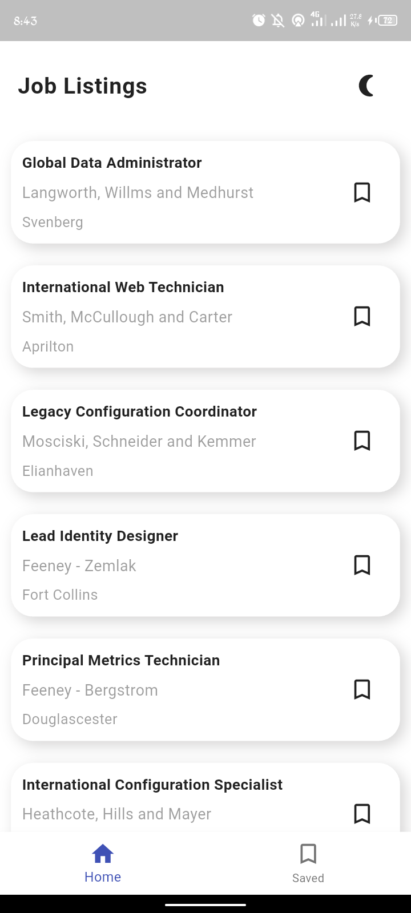

# Jobby

Jobby is a Flutter-based job listing app designed to help users browse, save, and explore job opportunities with ease. It follows clean architecture principles and leverages modern Flutter development tools for maintainability and scalability.

## Features

- Search and view job listings
- Save jobs for later access
- Toggle between light and dark themes
- View full job descriptions
- Clean and modular codebase
- Built with BLoC, Dio, and Freezed

## Tech Stack

- Flutter
- BLoC (Business Logic Component)
- Dio (HTTP Client)
- Freezed (Modeling and immutability)
- ThemeData (Dynamic theming)
- Mock API (Used for demonstration)

## App Views

